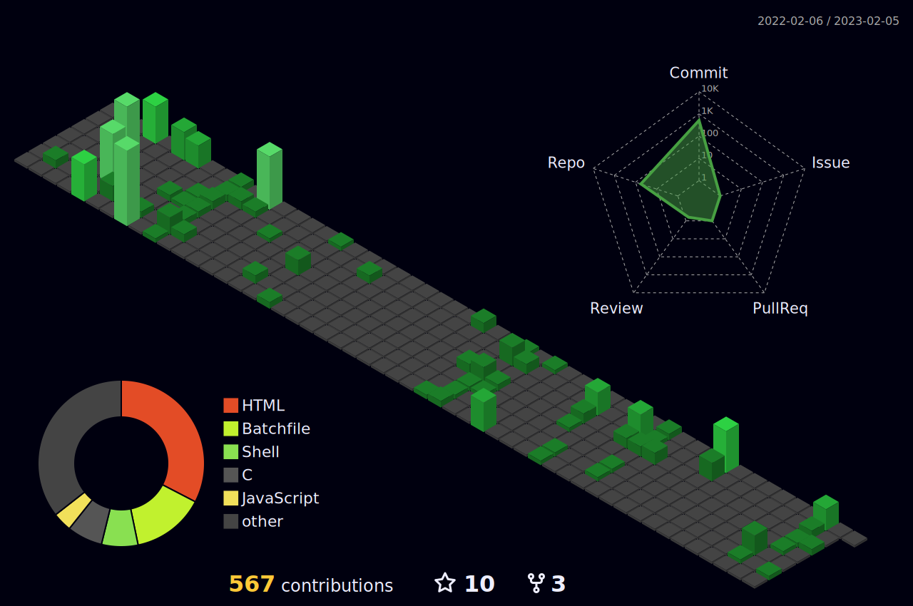

 
 
 

# Hi there! How are you�
A README made with **Markdown**, *[great ideas](https://github.com/cristiancmoises) and   *   
## <> ᴀʙᴏᴜᴛ ᴍᴇ </>
#### Hi i'm  Ajit Patel and I'm an Indian **developer**. I'm here on GitHub to:
***- Share my codes;***
***- Learn more about Android, cybersecurity, front-end and back-end technologies;***
***- Contribute to third-party projects;***
***- Get inspiration and new ideas!***

Feel free to visit [my repositories](https://github.com/ajitpatel28?tab=repositories). Doubts or suggestions, please open an issue and let's talk!

---

 ## <🛠> ᴛᴇᴄʜ ꜱᴛᴀᴄᴋ </🛠>
| **PROPERTY** | **DATA** |
| --- | --- |
| **Language/IDE** |    
| **Database** | 
| **OS** |
| **Tools & Platform** |   

---
## <📊> ɢɪᴛ ꜱᴛᴀᴛꜱ </📊>
 
 

 |  
| ----------- | ------------ |
---

## <📫> ʜᴏᴡ ᴛᴏ ʀᴇᴀᴄʜ ᴍᴇ </📫>
 
---

------
## 🤟𝘾𝙤𝙣𝙣𝙚𝙘𝙩 𝙒𝙞𝙩𝙝 𝙈𝙚: 

[<a href="https://ajitpatel28.github.io/portfolio/">]
[<a href="https://www.linkedin.com/in/ajitpatel28/"> ]

  [<a href=https://gnu.org> ]
   

      
   
 
    
   
𝙇𝙖𝙨𝙩 𝙀𝙙𝙞𝙩𝙚𝙙 𝙤𝙣: 06/02/2023
    <!-- 
 -->
